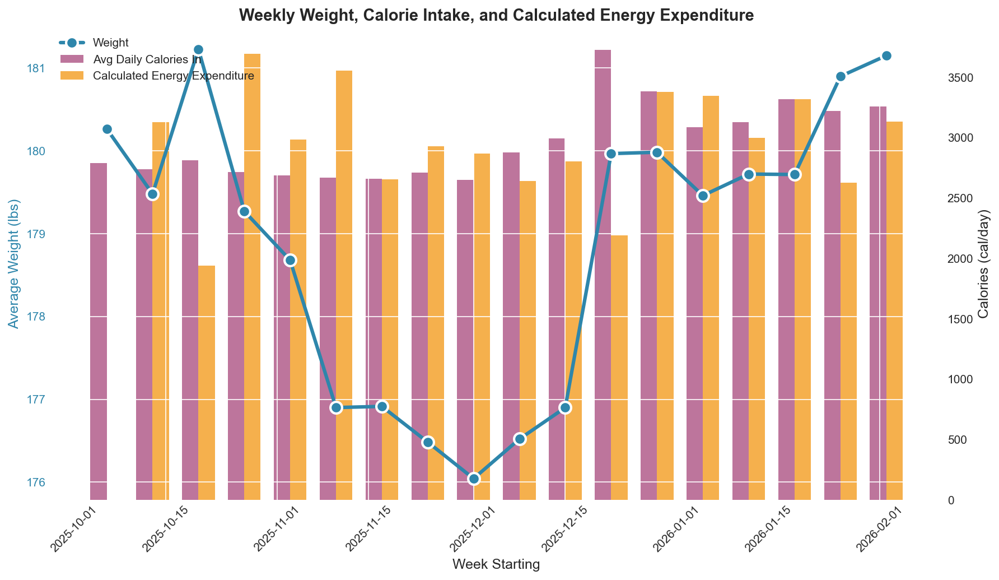
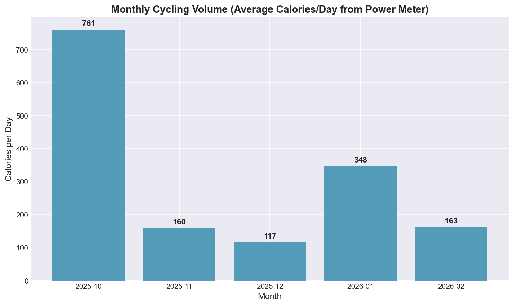

# Energy Expenditure Analysis

**Investigating why calculated energy expenditure remained flat despite increased cycling volume**

*Analysis date: February 7, 2026*

---

## Background

In November and December 2025, I was lifting weights with minimal cardio. In January 2026, I started cycling intensely—3 to 5 hours per week on the bike, with a power meter tracking every watt.

When I calculated my energy expenditure from weight and nutrition data, **January looked almost identical to November**. My calculated "calories out" was flat, despite nearly doubling my cycling volume.

This analysis investigates why.

---

## The Data

### Weight & Nutrition Tracking

I tracked daily weight and nutrition (calories in) throughout this period using MacroFactor. The data shows:

| Period | Avg Daily Calories | Avg Weight | Calculated Expenditure |
|--------|-------------------|------------|------------------------|
| November | 2,683 | 177.2 lbs | 3,031 cal/day |
| December | 3,126 | 177.4 lbs | 2,776 cal/day |
| January | 3,188 | 179.9 lbs | 3,073 cal/day |

The calculated expenditure uses a standard formula:

```
Expenditure = Calories In - (Weekly Weight Change × 500 cal/day)
```

November to January: expenditure went from 3,031 → 3,073. That's only **42 cal/day difference**—essentially flat.



### Cycling Volume (from Strava)

Meanwhile, my actual cycling activity looked very different:

| Month | Cycling Hours | Cycling Cal/Day |
|-------|--------------|-----------------|
| November | 9.2 hrs | 160 cal/day |
| December | 5.9 hrs | 117 cal/day |
| January | 16.8 hrs | 348 cal/day |

January cycling burned **188 cal/day more** than November. This is measured directly from power meter data (kJ is roughly equal to kcal), not estimated.



### The Discrepancy

If November baseline expenditure was ~3,030 cal/day, adding 188 cal/day of cycling should bring January to ~3,220 cal/day.

Instead, the formula shows 3,073—about **150 cal/day lower than expected**.

Where did those calories go?

---

## A Hypothesis

The formula `Expenditure = Calories In - Weight Change` has a hidden assumption: **all weight change is fat**. It uses 3,500 cal/lb because that's roughly the energy density of body fat.

The most likely explanation for the discrepancy is that a significant portion of the weight gain was not fat. Several factors may have contributed:

### 1. Glycogen & Water Rebound

In October through December, I was running a caloric deficit (averaging 2,700 cal/day). Caloric restriction typically depletes muscle glycogen and the water that comes with it.

When I increased calories in January (~3,200 cal/day), my body would have refilled those glycogen stores. Each gram of glycogen binds 3-4 grams of water.

**Estimated rebound: 2-3 lbs** (nearly calorie-free)

### 2. Cycling Adaptation

Starting a new intense cardio stimulus can cause muscles to increase glycogen storage capacity. Research shows trained muscle stores ~65% more glycogen than untrained muscle.

My FTP increased from 250W to 275W in January—a 10% gain suggesting significant peripheral adaptation.

**Estimated adaptation: 1-1.5 lbs** of additional glycogen + water

### 3. Lower Body Muscle Gain

I'm in my "noob gains" phase for lower body lifting, progressing rapidly on squats and deadlifts. Research suggests beginners can add 1-2 lbs of muscle per month with proper training.

**Estimated muscle gain: 1-2 lbs** over the 2-month period

### The Math

| Component | Scale Weight | Caloric Cost |
|-----------|-------------|--------------|
| Glycogen/water rebound | 2-3 lbs | ~800 cal |
| Cycling adaptation | 1-1.5 lbs | ~400 cal |
| Muscle gain | 1-2 lbs | ~3,000-5,000 cal |
| **Total lean mass** | **4-6.5 lbs** | **~4,200-6,200 cal** |

The formula sees 5.3 lbs of weight gain and assumes I stored **18,500 calories** (5.3 × 3,500).

If most of that weight is lean mass, the actual caloric cost would be closer to **4,000-6,000 calories**.

That would represent a ~12,000-14,000 calorie discrepancy over 9 weeks, or **~175-220 cal/day** that the formula incorrectly attributes to overeating.

---

## Adjusted Expenditure

If the lean mass hypothesis is correct:

| Metric | Value |
|--------|-------|
| Formula-calculated expenditure | 3,073 cal/day |
| Lean mass adjustment | +175-200 cal/day |
| **Estimated true expenditure** | **~3,250 cal/day** |

This would align with expectations: November baseline (~3,030) plus cycling increase (~190) = ~3,220 cal/day.

---

## Fat Change Estimate

If the lean mass estimates are accurate:

- **Total scale weight gain (Dec → Feb):** 5.3 lbs
- **Estimated lean mass gain:** 4.0-6.5 lbs
- **Implied fat change:** -1.2 to +1.3 lbs

**If this hypothesis is correct, it suggests essentially zero fat gain**, despite the scale showing a 5+ lb increase. The weight would be predominantly muscle, glycogen, and water.

Without body composition measurements (DEXA, etc.), this remains an educated estimate rather than a confirmed fact.

---

## Key Takeaways

1. **Scale weight can be a poor proxy for energy balance** during periods of body composition change—especially when transitioning from a deficit to maintenance, or adding new training stimuli.

2. **The 3,500 cal/lb rule assumes fat**, but glycogen + water can add pounds to the scale with almost no caloric cost.

3. **Power meter data provides ground truth** for exercise calories. Without it, there would be no way to verify that the cycling volume had actually increased.

4. **The body adapts to new stimuli** by storing more glycogen. This is beneficial for performance, but may temporarily obscure energy balance calculations.

5. **Patience required.** Once glycogen stores stabilize and the initial adaptation period ends, weight-based calculations should become more accurate.

---

## Data Sources

- **Weight & Nutrition:** MyFitnessPal export (Oct 2025 - Feb 2026)
- **Activity:** Strava export with power meter data
- **Analysis:** Python/pandas, methodology documented in project repository

---

## References

### Glycogen Storage and Training Adaptation

1. Hargreaves M, Spriet LL. [Skeletal muscle energy metabolism during exercise](https://www.nature.com/articles/s42255-020-0251-4). *Nature Metabolism*. 2020;2:817-828. — Overview of muscle glycogen utilization during exercise.

2. Murray B, Rosenbloom C. [Fundamentals of glycogen metabolism for coaches and athletes](https://pmc.ncbi.nlm.nih.gov/articles/PMC6019055/). *Nutrition Reviews*. 2018;76(4):243-259. — Reports that untrained individuals store ~15g glycogen/kg muscle while trained endurance athletes store ~25g/kg.

3. Greiwe JS, et al. [Effects of endurance exercise training on muscle glycogen accumulation in humans](https://journals.physiology.org/doi/full/10.1152/jappl.1999.87.1.222). *Journal of Applied Physiology*. 1999;87(1):222-226. — Found muscle glycogen concentration was 164 mmol/kg (trained) vs 99 mmol/kg (untrained), with GLUT-4 content twofold higher in trained state.

4. Knuiman P, et al. [Glycogen availability and skeletal muscle adaptations with endurance and resistance exercise](https://pmc.ncbi.nlm.nih.gov/articles/PMC4687103/). *Nutrition & Metabolism*. 2015;12:59. — Reviews how training increases glycogen storage capacity.

### Muscle Gain Rates

5. Morton RW, et al. [A systematic review, meta-analysis and meta-regression of the effect of protein supplementation on resistance training-induced gains in muscle mass and strength in healthy adults](https://pubmed.ncbi.nlm.nih.gov/28698222/). *British Journal of Sports Medicine*. 2018;52(6):376-384. — Meta-analysis on muscle gain rates with resistance training.

### Glycogen and Water Binding

6. Fernández-Elías VE, et al. [Relationship between muscle water and glycogen recovery after prolonged exercise in the heat in humans](https://link.springer.com/article/10.1007/s00421-015-3175-z). *European Journal of Applied Physiology*. 2015;115(9):1919-1926. — Demonstrates the 3g water per 1g glycogen relationship.
